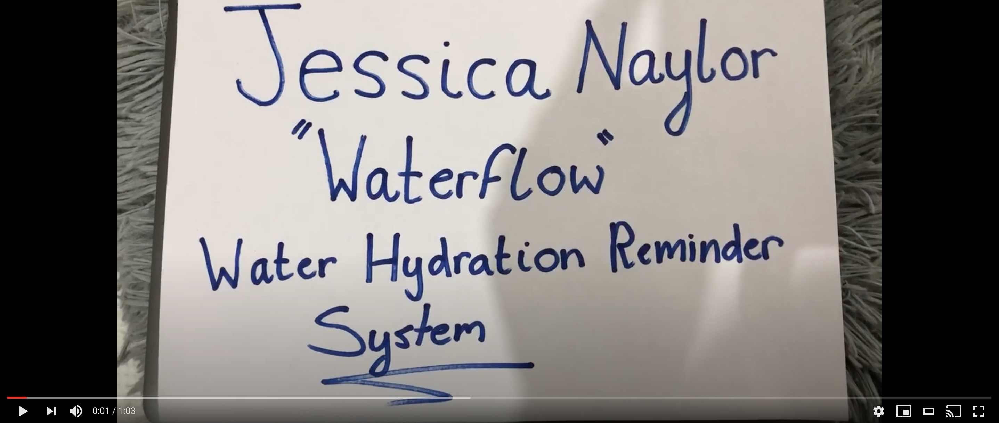

# *WaterFLow*
## *Jessica Naylor* ##
## 1701QCA Making Interaction 2020 Final Project ##

The image should be inserted with code like that below where you replace the filename to exactly match what you uploaded. This will only work reliably if your filename has no spaces or unusual characters in it. The image must be in .jpg, .gif, .png format. Files of .heic or .heif type will not show up. Note that .png is different to .PNG in a filename here. The names are case sensitive.
--->

This is the WaterFlow, a personal water hydration Reminder System. This item is for the many individuals who find it difficult to remain hydrated due to their busy work lives. Users would place their water bottles inside the bottle compartment and every 10 minutes, they will be reminded to drink water.

### Journal ###

[Process and reflection journal](/journal/journal.md)
