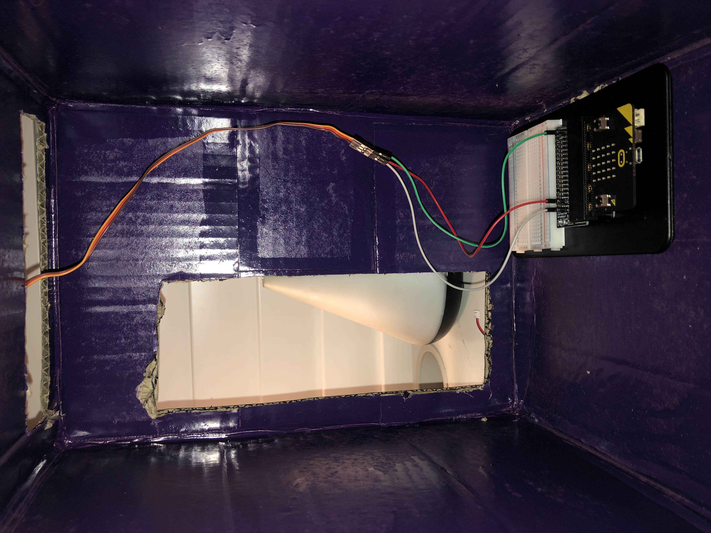

# 1701QCA Final project journal: Jessica Naylor

## Related projects ##
### Related project 1 ###
Security Box

https://make.techwillsaveus.com/microbit/activities/security-box

This project is related to the project that I am creating because it sets off an alarm. This is a feature that is being utilised in my project.  The alarm in this project is used to alert the owner when someone has opened the box, whereas the alarm in my project is being used to alert the user when it is time to have another drink. 

### Related project 2 ###
Countdown Timer

https://makecode.microbit.org/projects/watch/timer

How its similar - This project is similar to the project that I am creating because it involves a timer that countdown. In my project, the timer will reactivate every 5 minutes, this will then trigger an output that tells the user it is time to drink once again. 

### Related Project 3 ###
Making a Room Alarm with Micro: bit

https://www.youtube.com/watch?v=igeUhVMqVRw

 

How its similar - This project is similar to the project that I am creating because it once again is an alarm. This is a factor that is going to be used in this project. However, this alarm is activated when it is trigger, acting as a security system, whereas my project has an alarm that goes off after a certain time rather than when it is triggered.

### Related Project 4 ###
Micro: bit Name Tag

https://www.seeedstudio.com/blog/2019/12/10/top-25-microbit-projects-for-beginners-2019/

How its similar - This project is similar to the project that I am creating because it displays a string of text on the micro: bit LED screen. My project will display the words “drink water” when the timer is up. 

### Related project 5 ###
Reading Temperature Using Micro: bit

https://www.seeedstudio.com/blog/2019/12/10/top-25-microbit-projects-for-beginners-2019/

This project is related to the project that I am creating because it uses a motor to control the temperature gauge. I will be using a motor in my project to turn the platform that the water bottle sits on. 

### Related project 6 ###
Micro: bit Egg Timer

https://www.myminifactory.com/object/3d-print-micro-bit-egg-timer-18361

This project is related to the project that I am creating because it is a timer. In my project, I will be using an automatic countdown timer to indicate when the outputs go off. This project lets the individual once the egg has finished cooking using an automatic timer. 

## Other research ##
https://makecode.microbit.org/device/servo

As I have not tested the motor yet, I am unsure as to whether I will need to use a mini servo instead in my project to assist with the turning of the water bottles platform. This site explains how to equip the servo with “crocodile clips” that have been created from male strips. 

https://makecode.microbit.org/v0/86038-41904-40055-73164

The following source shows the code required for an alarm to play. This can be beneficial when creating the code for this project as it assists in creating alarm reminding the user to drink water. 

https://www.kitronik.co.uk/blog/using-bbc-microbit-control-servo/

This source explains how to use the BBC Micro:bit to control the servo. This is important as it will assist me in getting the servo to work effectively and spin the platform at the correct speed. 

https://support.microbit.org/support/solutions/articles/19000024000-fault-finding-with-a-micro-bit

In the past, I have had issues attempting to get the micro:bit to work. This website gives me a step by step guide as to how to get the micro: bit working again if the issues reoccur. This is extremely beneficial as it can endure that I do not waste time trying to fix the micro: bit on my own.

https://www.youtube.com/watch?v=qdX86in2YXo

This youtube video assisted me in learning how to correctly connect my servo motor to my micro:bit breadboard. It is a quick and easy video that was clear and helped me set up the servo motor in just a few minutes. 

## Conceptual development ##

### Design intent ###
In today's society, it is extremely common for people to forget to remain hydrated due to their busy schedule. Dehydration can cause many issues including foggy memory, irritability and an increase in anxitey. Dehydration has also been proven to be a huge contbutor to kindey stones. This project is a simple item that wouls assist these individuals who forget to remain hydrated throughout the day. This project will remind users when they need to drink water to ensure that they remain hydrated and healthy throughout the day. 

### Design ideation ###

### Design concept 1 ###

### Design concept 2 ###

### Final design concept ###

### Interaction flowchart ###

## Process documentation ##

This was the first rough sketch of the main idea. In this sketch, i wrote in a step by step process, how the project owuld work and what the outputs would be/how they would be acheived. I also wrote out the base materials that I assumed would have been required at the time.

This was a more thorough materials list that I wrote once I had chosen the project that I was going to create. This gave me an idea as to what I would need for both the prototype and the final project. It is still yet to be expanded.

This is part of the code that I have been testing. Rather than doing all of the code at once, I decided to break it down so that I could ensure that each section of my code is correct. This is the code that I was working on for the alarm rhat is going to play. In this code I worked on finding the correct melody that I wanted to play to alert the users.

This was the part of the code to control the mini servo. It still needs to be modified and added to, but I was focusing on getting a base for this code down so that I could unerstand how and if it works before I move forward.

This is the prototype of the project that I am going to create. This was built using carboard as it was only a rough outline of how I wanted the final project to look. Creating this prototype allowed for me to correctly find out the measurments of the project so that when I am making the final project, I successfully use the correct measurements to ensure that everything fits perfectly.

This is the box that I chose to use for my final project. Due to corona, my original budget for spending on this project was severly cut back. This meant that I was given no choice but to use materials that are cheap. This is why I chose to use carboard. 

This was the first layer of paint that I put on. I wanted the main coat of paint to apply nice and smoothly to the box so I placed this first layer down to ensure that the blue went on well and did not look patchy. 

This was the main coat of paint that I chose to use. This is a dark colour that I felt would work extrmely well with the colour sheme that I was going for. This would not be the colour of every one that was created if this were to be developed more in the future. 

This was what the box looked like once it had been painted. This was only one of several coats of paint.

I then painted on the title of the project. I wanted ot use a bright colour for this that would stand out from the box itself. I origionally layered on a white coat and then once that had dried I moved onto a yellow coat. This brightens up the box and immediately draws the users attention to the name. 

The sign was the next item that I created. This involved a bamboo stick that I shortened. I then painted the bamboo stick black. Once this was done. I Cut out another piece of carboard and painted it white. Once the paint had dried I wrote on the sign "time to drink water" in black marker. I chose to write it in pen rather than in paint because I felt as though it would be substnacially neater if I wrote it in pen. 

This is the compartment that I built for behind the bottle section. This gave the section a more enclosed, neat look where the bottle could securely fit into. 

This is the section that I had to cut out at the top of the box so that the servo motor would effectively be able to the sign from side to side whilst still remaining hidden by the box.

This is the setup that I had built for the servo motor onto the micro:bit breadboard. This was one of the steps towards getting the servo motor to correctly work. 

This is what the back of the box looked like before everything had been secured into their final positions. 

This is what the back compartment looked like once the micro:bit and breadboard had been secured and the bottle compartment had been fitted. 

This is what the project looked like once I had set everything up. This is what the users would see. 

This is what the project looks like when the battery pack was attached to the micro:bit. As you can see, the micro:bit has a smiley face that is shown on the screen. 

## Final code ##

## Design process discussion ##
The first step involed in creating this project was to understnad what it was that I wanted to create. I have recently noticed that many people (including myself) were not remaining as hydrated as they should be. This is due to our busy daily schedules preventing us from remebering to keep up with our daily water intake. This was where I chose to create an object that will help us with this issue. When creating this project, I chose to follow the Design Process. https://discoverdesign.org/handbook This method suggests that you should first define the issue at hand. Once I had done that, I began to collect information about what would be the most effective/efficient way to create this project to suit users needs. This is where the next step of brainstorming and alaysing took place. I brainstormed several design concepts shown above. When analysing the issue of dehydration, I became aware that many of those who are not hydrated enough blame it on how busy they are working. This became apparent to me that those who were sitting at an office doing their jobs were generally too busy to remember to hydrate. This was why I chose to make this project one that can be placed on a desk right next to the individual so that they can still effectively continue their work. I am surrently up to the 4th step on the Design Process, which is building a model. The image above shows the prototype that has been created. This is not the final product, but it gives people a clear understanding as to what it is that I am trying to achieve in the future. These steps are much like the ones within the Double Diamond Design. To effectively complete this project, I had to discover and define the main issue, to then be able to develop and deliver a result that may be extrmely beneficial to help those remain hydrated and healthy.

When I first began the development of this project, my origional plan involved a rotating platform that would spin the bottle round when the micr:bit timer went off. This was going to act as an alert system for the user, which would encourage them to pick up the bottle and drink the water, gradually increasing their daily intake of water. However, once I began testing these methods, it quickly became apparent to me that the motor that I had from my inventors kit was not durable enough to successfully hold a bottle full of water and spin around at the same time. This issue meant that I had to adapt and come up with a new way to alert the users to drink water. The new idea that I came up with was to have a sign on the top of the box that would move when the time was up. This idea was one that seemed substancially more achiveable as I still had a servo motor from the last assessment. I created the sign and attached it to the servo motor with tape and tested it out. This was successful.

The process of building this project was extremely difficult. Originally, I had planned to build this project using some form of wood, but due to the COVID-19 lockdown and being put out of work, I had ot drastically reduce my original budget. It was because of this that I chose to use carboard and bamboo sticks. These were substancially cheaper. I used other items such as glue and double sided-tape. I already had paint and spray paint so I was able ot use them to attempt to make the box look more presentable. The building process took several days due to the slow process of waiting for paint a glue to dry. However, in the end, I was extrmeely happy with the overall result given the circumstances. 

In the end, this project provides the origional intent. The original intent was to create something that would alert people when they should drink water. This successfully does that. The user places their water bottle into the water bottle compartment. They then press button A to activate the countdown timer. In the display video, I set the timer to 15 seconds so that I could display what the output would be without the viewers having to wait 10 minutes for it to take place. Once the time is up, the servo motor activates, which moves the sign back and forth whislt a string is displayed on the screen. Once the person has finished drinking, they press button B, which then stops the servo motor and displays a string prasiing the user for drinking the water, and it then resets. 

## Reflection ##

<!--- Describe the parts of your project you felt were most successful and the parts that could have done with improvement, whether in terms of outcome, process, or understanding.

What techniques, approaches, skills, or information did you find useful from other sources (such as the related projects you identified earlier)?

What parts of your project do you feel are novel? This is IMPORTANT to help justify a key component of the assessment rubric.

What might be an interesting extension of this project? In what other contexts might this project be used? --->
